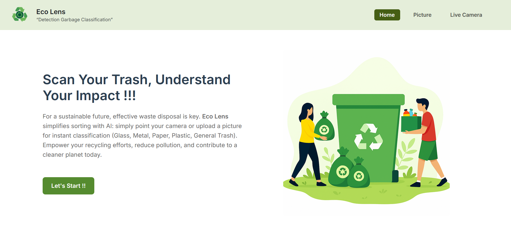
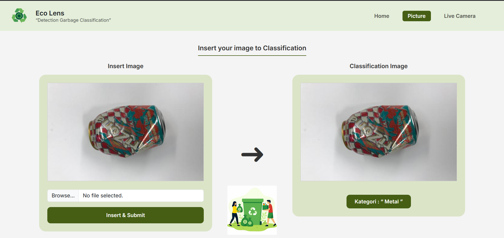
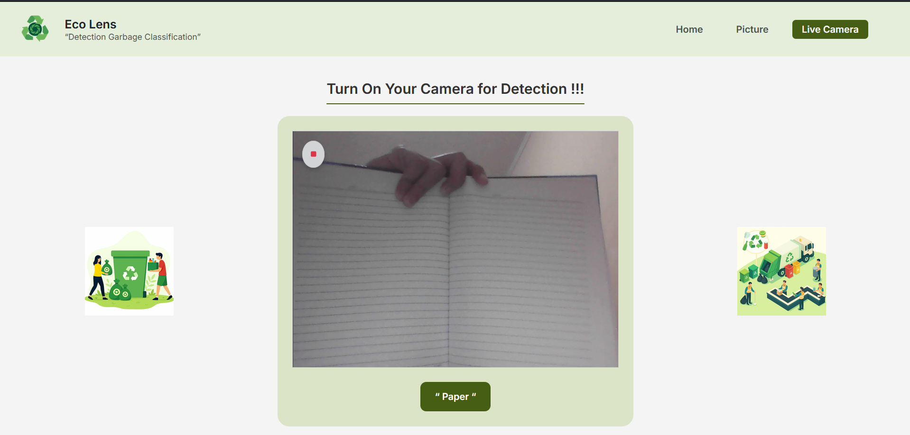
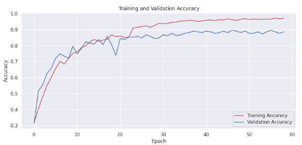
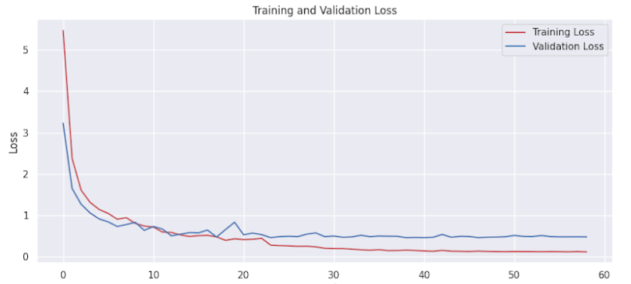

# 🗑️ Eco Lens – Garbage Classification Based on Image Data (CNN + Flask)

**Eco Lens** is an AI-powered waste classification system that leverages **Computer Vision** and **Convolutional Neural Networks (CNN)** to categorize garbage images into five classes: **glass**, **metal**, **paper**, **plastic**, and **trash**.

Just upload a photo of your waste — and **Eco Lens** will instantly detect and classify it through a clean, user-friendly **Flask web app**.  
Perfect for smart recycling, environmental education, and automated waste management systems.

> ♻️ Eco Lens: See the future of waste sorting through the lens of AI.

---
## 📸 Demo

<!-- Baris pertama: 2 gambar sejajar -->
<table align="center">
  <tr>
    <td align="center">
       
      <em>Homepage – users are introduced to Eco Lens with a CTA and mission statement.</em>
    </td>
    <td align="center">
       
      <em>Picture Page – users can upload an image to classify the waste type.</em>
    </td>
  </tr>
</table>

<!-- Baris kedua: 1 gambar di tengah -->

   
  <em>Live Camera – users can detect trash type in real-time using their webcam.</em>

## 📚 Table of Contents

- [📌 About the Project](#-about-the-project)
- [🗃️ Dataset](#️dataset)
- [🛠️ Technologies Used](#️technologies-used)
- [🧠 Model Training](#️model-training)
- [🌐 Flask Web App](#-flask-web-app)
- [⚙️ How to Run Locally](#️how-to-run-locally)
- [📷 Screenshots](#-screenshots)
- [📈 Result & Accuracy](#-result--accuracy)
- [📄 License](#-license)
- [🙋‍♂️ Author](#-author)

---

## 📌 About the Project

Every day, tons of waste are produced — but most of it ends up unsorted, making recycling harder and pollution worse. Traditional waste sorting is not only time-consuming, but also prone to error.

**Eco Lens** is here to change that.

By combining **Computer Vision** and **Convolutional Neural Networks (CNN)**, this project enables automatic image-based waste classification into five categories: **Glass**, **Metal**, **Paper**, **Plastic**, and **Trash**.

Just one photo, and the system can instantly recognize the type of waste — making sorting smarter, faster, and more scalable for real-world environmental impact.

> ♻️ Let AI help us build a cleaner future — one image at a time.

---

## 🗃️ Dataset

To train the Eco Lens model, we used a publicly available dataset from Kaggle:  
🔗 [Garbage Classification Dataset](https://www.kaggle.com/datasets/asdasdasasdas/garbage-classification/data)

This dataset contains a wide range of **labeled waste images**, making it ideal for computer vision-based classification. The data is neatly organized into five main categories:

- 📁 `glass/`  
  *Bottles, jars, and other glass waste*

- 📁 `metal/`  
  *Aluminum cans, foils, and metallic scraps*

- 📁 `paper/`  
  *Newspapers, books, cartons, and paper sheets*

- 📁 `plastic/`  
  *Bottles, containers, and plastic packaging*

- 📁 `trash/`  
  *General waste that doesn’t fall into the categories above*

Each folder contains hundreds of real-world images that help the CNN model learn visual patterns such as **color**, **shape**, and **texture** unique to each material type.

This structure enables efficient training and helps Eco Lens deliver accurate, real-time classification results — just from an image.

---

## 🛠️ Technologies Used

- Python 3.10+
- TensorFlow / Keras
- Flask
- OpenCV
- NumPy & Pandas
- Matplotlib & Seaborn
- Scikit-learn

---

## 🧠 Model Training

The Eco Lens training pipeline was carefully designed to ensure the model learns to accurately identify waste types from images. Here’s how the process flows:

- 📥 **Dataset Loading & Preprocessing**  
  Importing image data, organizing folders, and preparing labels for each category.

- 🖼️ **Image Resizing & Normalization**  
  Standardizing all images to the same dimensions and pixel scale to ensure smooth training.

- 📊 **Exploratory Data Analysis (EDA)**  
  Visualizing class distributions, inspecting sample images, and identifying data imbalances.

- 🧪 **Data Augmentation & Oversampling**  
  Applying techniques like rotation, zoom, and flipping — plus oversampling underrepresented classes to avoid bias.

- 🧠 **CNN Model Design & Training (3 Phases)**  
  Using a custom Convolutional Neural Network trained in three iterations with fine-tuned hyperparameters.

- 📈 **Model Evaluation**  
  Analyzing accuracy, loss curves, and confusion matrix to validate model performance and identify areas for improvement.

> ✅ **The final model** demonstrated strong performance, achieving **96% training accuracy** and **88% validation accuracy** in the third phase — making it well-suited for real-world garbage classification scenarios.

## 🌐 Flask Web App

The trained CNN model (`final_model_33.h5`) is deployed using a Flask web application with **modular HTML templates** and **Bootstrap styling** for a clean and responsive user experience.

### 📁 Project Structure

- 📂 `static/uploads/`  
  *Folder to store uploaded images*

- 📂 `templates/`  
  *HTML templates used by Flask:*
  - 📄 `index.html` — Homepage with introduction and CTA  
  - 📄 `picture.html` — Upload image & display classification result  
  - 📄 `live_camera.html` — Real-time classification via webcam  
  - 📄 `cek.html` — Combined image + camera detection interface  
  - 📄 `header.html` — Reusable navigation/header component  

- 📄 `app.py`  
  *Main Flask application script*

- 📄 `final_model_33.h5`  
  *Trained CNN model file*

- 📄 `requirements.txt`  
  *Python dependency list*

- 📄 `start.sh`  
  *Optional script to run the app (Linux)*

### ⚙️ Key Features

- Upload and preview images of garbage  
- Real-time classification using trained CNN model  
- Live camera detection directly from browser  
- Responsive UI with Bootstrap  
- Clean modular structure (HTML + Python)

> 💡 Simply run `python app.py`, open your browser, and start classifying waste images with **Eco Lens**!

## ▶️ Route Overview (`app.py`)

These are the key routes handled by the Flask backend:

- 🌐 `/`  
  *Homepage for uploading garbage images.*

- 📤 `/predict`  
  *Processes uploaded image and returns classification result.*

- 🖼️ `/picture`  
  *Displays the uploaded image along with prediction result.*

- 🎥 `/live_camera`  
  *Enables real-time prediction using the device webcam.*

- 🔀 `/cek`  
  *Combined interface: upload + live camera detection in one page.*

> ⚙️ The app runs **locally on port 5000** and is styled using **Bootstrap** for a clean and responsive UI.

## ⚙️ How to Run Locally

### 1. Clone repo
git clone https://github.com/MuhammadAfdhalF/Garbage-Classification-by-Images-Data-CNN-and-Flask-API-

### 2. Install dependencies
pip install -r requirements.txt

### 3. Run Flask App
python app.py

Then open your browser and go to:
👉 http://127.0.0.1:3000/

## 📈 Result & Accuracy

The final model shows solid performance with the following metrics:

- ✅ **Training Accuracy:** 96.96%  
- ✅ **Validation Accuracy:** 88.63%  
- ✅ **Final Accuracy:** ~86% (on validation data)  
- 📉 **Training Loss:** 0.1116  
- 📉 **Validation Loss:** 0.4724  
- 🧠 **Learning Rate:** 7.8125e-06  

### 📉 Training Curves

The plots below show how the model's performance evolved during training:

  
  

- **Left:** Accuracy curve showing convergence between training and validation sets  
- **Right:** Loss curve indicating decreasing error with each epoch

---
## 🙋‍♂️ Author

**👨‍💻 Muhammad Afdhal F**

- 📧 Email: [cuyafdal@gmail.com](mailto:cuyafdal@gmail.com)  
- 📷 Instagram: [@holla.cuy](https://instagram.com/holla.cuy)  
- 💼 LinkedIn: [Muhammad Afdhal F](https://id.linkedin.com/in/muhammad-afdhal-f-3b3317217)  
- 🧠 Passionate in Mobile Dev, Web Dev, and AI
- 🚀 Let’s build cool things together!
